# 📚 Literalura - Sistema de Gestión de Libros y Autores

Una aplicación de consola interactiva construida con **Spring Boot 4.0.3** que permite gestionar una biblioteca digital con información de libros y autores. El proyecto consume datos de APIs externas para enriquecer la información literaria.

## 🎯 Descripción del Proyecto

Literalura es un challenge de la especialización de Java y Spring Boot de Alura que simula un catálogo de literatura clásica. Permite realizar consultas, búsquedas y análisis estadísticos sobre libros y autores usando una base de datos relacional.

## ✨ Características Principales

### Gestión de Libros y Autores
- ✅ Guardar nuevos libros en la base de datos
- ✅ Buscar libros por título
- ✅ Listar todos los libros registrados
- ✅ Filtrar libros por idioma
- ✅ Ver el Top 10 de libros más descargados
- ✅ Listar autores registrados
- ✅ Buscar autores por nombre
- ✅ Filtrar autores por rango de años

### Análisis de Datos
- 📊 Listar autores vivos en un año determinado
- 📊 Listar autores sin fecha de fallecimiento
- 📊 Mostrar estadísticas de libros guardados
- 📊 Mostrar estadísticas de autores guardados
- 📊 Identificar el autor más popular

## 🛠️ Tecnologías Utilizadas

| Tecnología | Versión | Descripción |
|-----------|---------|------------|
| **Java** | 17 | Lenguaje de programación |
| **Spring Boot** | 4.0.3 | Framework de desarrollo |
| **Spring Data JPA** | - | Acceso a datos |
| **PostgreSQL** | - | Base de datos relacional |
| **Jackson** | 2.16.1 | Procesamiento de JSON |
| **LangChain4j** | 0.36.2 | Integración con IA (HuggingFace) |
| **Maven** | - | Gestor de dependencias |

## 📋 Requisitos Previos

- **Java 17** o superior
- **Maven** 3.6+
- **PostgreSQL** configurado y en ejecución
- Variables de entorno configuradas:
  - `DB_HOST`: Host de la base de datos
  - `DB_USER`: Usuario de PostgreSQL
  - `DB_PASSWORD`: Contraseña de PostgreSQL

## 🚀 Instalación

### 1. Clonar o descargar el proyecto
```bash
cd literalura
```

### 2. Configurar variables de entorno
Asegúrate de que exista la base de datos `literAlura_db` en PostgreSQL:
```sql
CREATE DATABASE "literAlura_db";
```

Establece la Configuración de Variables de Entorno (detallado más adelante)

### 3. Compilar el proyecto
```bash
mvn clean install
```

### 4. Ejecutar la aplicación
```bash
mvn spring-boot:run
```

O construir el JAR y ejecutarlo:
```bash
mvn clean package
java -jar target/literalura-0.0.1-SNAPSHOT.jar
```

## ⚙️ Configuración de Variables de Entorno

Para garantizar la seguridad de las credenciales y la flexibilidad de la aplicación, se utilizan variables de entorno para la conexión a la base de datos y la integración con servicios externos.

### 1. Variables Requeridas (Base de Datos)
Estas variables son necesarias para establecer la conexión con **PostgreSQL**:

* **`DB_HOST`**: Dirección del servidor de base de datos (ej: `localhost`).
* **`DB_USER`**: Usuario de la base de datos (ej: `postgres`).
* **`DB_PASSWORD`**: Contraseña del usuario de la base de datos.

### 2. Variable Opcional (IA)
* **`HF_API_KEY`**: Token de acceso para la API de **Hugging Face**. Se utiliza para la generación de resúmenes y traducciones.
  * *Nota: Si no se proporciona, la aplicación omitirá la funcionalidad de resumen/traducción sin interrumpir el flujo principal.*

---

### 🚀 Cómo establecer las variables en Windows

Puedes configurar estas variables directamente en tu terminal antes de ejecutar la aplicación.

#### **Mediante Símbolo del Sistema (CMD)**
```bash
set DB_HOST=localhost
set DB_USER=postgres
set DB_PASSWORD=tu_contraseña
set HF_API_KEY=tu_token_aquí
```

#### **Mediante PowerShell** 

```PowerShell
$env:DB_HOST="localhost"
$env:DB_USER="postgres"
$env:DB_PASSWORD="tu_contraseña"
$env:HF_API_KEY="tu_token_aquí"
```

[!TIP]
¿No tienes un token de Hugging Face? > Puedes obtener uno de forma gratuita registrándote en [Hugging Face Settings](https://huggingface.co/settings/tokens).

### 🔑 Obtención del API Key
Para las funciones de traducción y resumen, la aplicación requiere un token de **Hugging Face**. 
1. Crea una cuenta en [huggingface.co](https://huggingface.co/).
2. Ve a **[Hugging Face Settings](https://huggingface.co/settings/tokens)**.
3. Genera un nuevo token de tipo `Read` y cópialo en tu variable de entorno `HF_API_KEY`.

## 📱 Menú Principal

Al iniciar la aplicación, verás el siguiente menú interactivo:

<p align="center">
  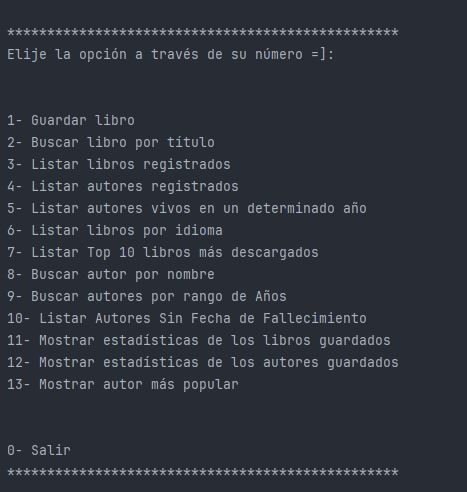
</p>

## 📁 Estructura del Proyecto

```
literalura/
├── src/
│   ├── main/
│   │   ├── java/com/aluracursos/literalura/
│   │   │   ├── LiteraluraApplication.java      # Punto de entrada
│   │   │   ├── model/                          # Entidades JPA
│   │   │   │   ├── Libro.java
│   │   │   │   ├── Autor.java
│   │   │   │   ├── Datos.java
│   │   │   │   ├── DatosAutor.java
│   │   │   │   ├── DatosLibros.java
│   │   │   │   └── Idioma.java
│   │   │   ├── principal/                      # Lógica de menú
│   │   │   │   ├── Principal.java
│   │   │   │   ├── MenuPrincipal.java
│   │   │   │   └── IdiomaMenuPrincipal.java
│   │   │   ├── repository/                     # Acceso a datos
│   │   │   │   ├── AutorRepository.java
│   │   │   │   └── LibroRepository.java
│   │   │   └── service/                        # Servicios
│   │   │       ├── ConsumoAPI.java
│   │   │       ├── ConvierteDatos.java
│   │   │       ├── IConvierteDatos.java
│   │   │       └── ConsultaHuggingFace.java
│   │   └── resources/
│   │       └── application.properties           # Configuración
│   └── test/
│       └── java/com/aluracursos/literalura/
│           └── LiteraluraApplicationTests.java
├── pom.xml                                      # Dependencias Maven
├── mvnw / mvnw.cmd                             # Maven Wrapper
└── README.md                                    # Este archivo

```

## 💾 Modelo de Datos

### Tabla: `autores`
| Campo | Tipo | Descripción |
|-------|------|------------|
| id | BIGINT (PK) | Identificador único |
| nombre | VARCHAR | Nombre del autor |
| fecha_de_nacimiento | INTEGER | Año de nacimiento |
| fecha_de_fallecimiento | INTEGER | Año de fallecimiento (nullable) |

### Tabla: `libros`
| Campo | Tipo | Descripción |
|-------|------|------------|
| id | BIGINT (PK) | Identificador único |
| titulo | VARCHAR (UNIQUE) | Título del libro |
| numero_de_descargas | DOUBLE | Cantidad de descargas |
| idioma | VARCHAR | Idioma del libro |
| resumen | TEXT | Resumen del libro |

### Tabla: `libros_autores` (Relación Many-to-Many)
| Campo | Tipo | Descripción |
|-------|------|------------|
| libro_id | BIGINT (FK) | Referencias a libros |
| autor_id | BIGINT (FK) | Referencias a autores |

## ⚙️ Configuración

### application.properties
```properties
spring.application.name=literalura
spring.datasource.url=jdbc:postgresql://${DB_HOST}/literAlura_db
spring.datasource.username=${DB_USER}
spring.datasource.password=${DB_PASSWORD}
spring.datasource.driver-class-name=org.postgresql.Driver

spring.jpa.hibernate.ddl-auto=update
spring.jpa.show-sql=true
spring.jpa.format-sql=true
```

**Notas de Configuración:**
- `ddl-auto=update`: Las tablas se crean/actualizan automáticamente
- `show-sql=true`: Muestra las sentencias SQL en la consola
- `format-sql=true`: Formatea el SQL para mejor legibilidad

## 🔌 Integraciones Externas

### APIs Consultadas
- **Gutendex API**: Base de datos de libros públicos para obtener información literaria
- **HuggingFace**: Servicio de IA utilizado para consultas adicionales

### Servicios
- **ConsumoAPI.java**: Cliente HTTP para consumir APIs externas
- **ConsultaHuggingFace.java**: Integración específica con HuggingFace
- **ConvierteDatos.java**: Conversión de JSON a objetos Java usando Jackson

## 🎮 Ejemplo de Uso

### 1️⃣ Guardar un libro
1. Selecciona opción `1`
2. Ingresa el título del libro
3. El sistema busca en Gutendex y guarda automáticamente

<p align="center">
  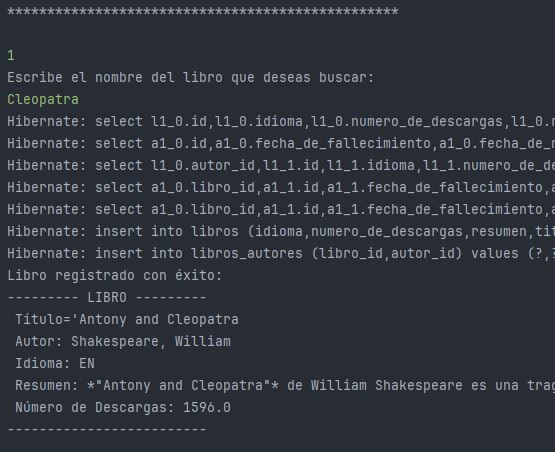
</p>

### 2️⃣ Buscar libro por título
1. Selecciona opción `2`
2. Ingresa el título del libro
3. El sistema busca en la base de datos

<p align="center">
  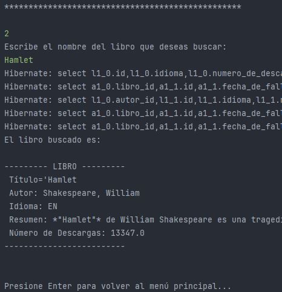
</p>

### 3️⃣ Listar libros registrados
1. Selecciona opción `3`
2. Se muestran todos los libros guardados en la base de datos
3. Visualiza título, autor, idioma, descargas y resumen

<p align="center">
  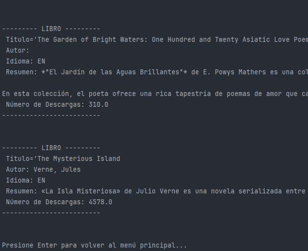
</p>

### 4️⃣ Listar autores registrados
1. Selecciona opción `4`
2. Se muestran todos los autores con sus libros asociados
3. Visualiza nombre, fecha de nacimiento y fecha de fallecimiento

<p align="center">
  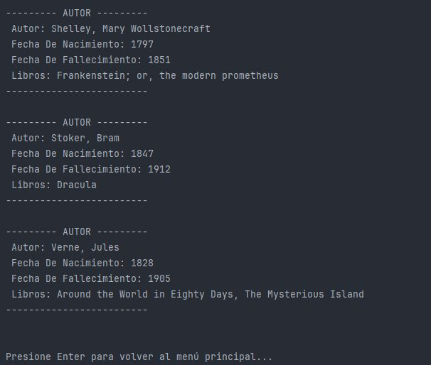
</p>

### 5️⃣ Listar autores vivos en un determinado año
1. Selecciona opción `5`
2. Ingresa el año que deseas consultar
3. El sistema filtra y muestra solo los autores vivos en ese año

<p align="center">
  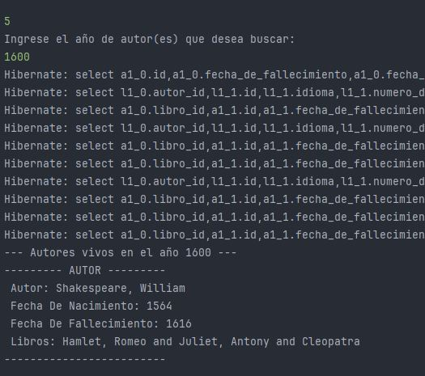
</p>

### 6️⃣ Listar libros por idioma
1. Selecciona opción `6`
2. Elige el idioma deseado de las opciones disponibles
3. Se muestran todos los libros en ese idioma

<p align="center">
  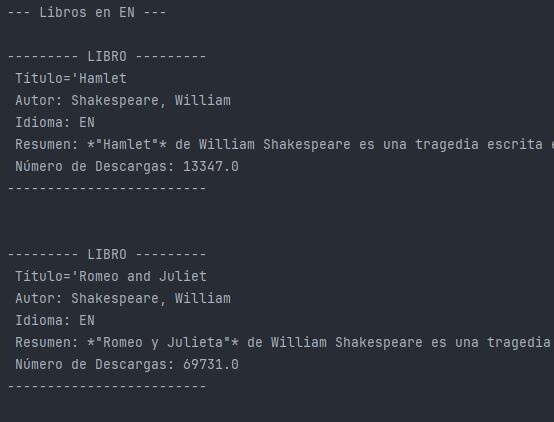
</p>

### 7️⃣ Listar Top 10 libros más descargados
1. Selecciona opción `7`
2. Se muestran automáticamente los 10 libros con mayor cantidad de descargas
3. Visualiza títulos ordenados de mayor a menor popularidad

<p align="center">
  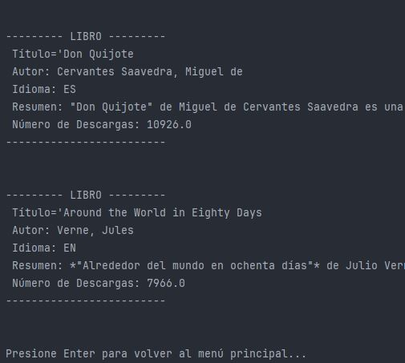
</p>

### 8️⃣ Buscar autor por nombre
1. Selecciona opción `8`
2. Ingresa el nombre del autor
3. Visualiza toda la información del autor y sus libros asociados

<p align="center">
  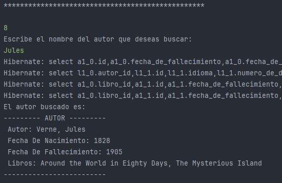
</p>

### 9️⃣ Buscar autores por rango de años
1. Selecciona opción `9`
2. Ingresa el año de inicio
3. Ingresa el año de fin
4. Se muestran autores nacidos dentro de ese rango

<p align="center">
  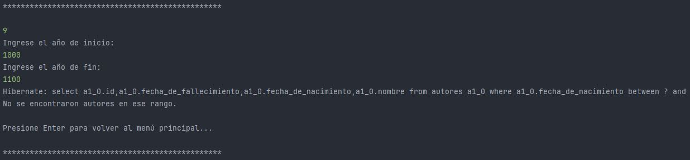
</p>

### 🔟 Listar autores sin fecha de fallecimiento
1. Selecciona opción `10`
2. Se muestran todos los autores cuya fecha de fallecimiento es desconocida
3. Estos son autores que podrían estar aún vivos o cuyo fallecimiento no está registrado

<p align="center">
  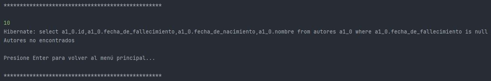
</p>

### 1️⃣1️⃣ Mostrar estadísticas de libros
1. Selecciona opción `11`
2. Se calculan y muestran estadísticas como:
   - Cantidad total de libros
   - Promedio de descargas
   - Libro más descargado
   - Libro menos descargado

<p align="center">
  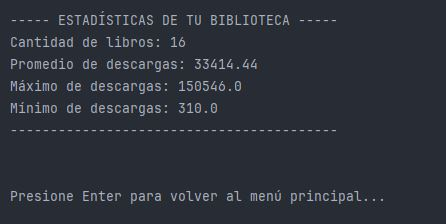
</p>

### 1️⃣2️⃣ Mostrar estadísticas de autores
1. Selecciona opción `12`
2. Se muestran estadísticas como:
   - Autor más antiguo nacido
   - Autor más reciente nacido
   - Promedio de años de nacimiento

<p align="center">
  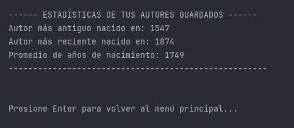
</p>

### 1️⃣3️⃣ Mostrar autor más popular
1. Selecciona opción `13`
2. Se identifica el autor con la mayor cantidad de descargas acumuladas
3. Se muestran sus libros y estadísticas de popularidad

<p align="center">
  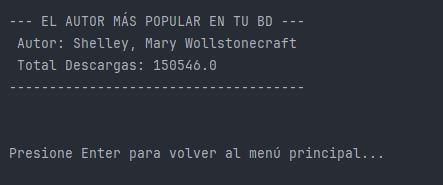
</p>

## 📝 Notas Importantes

- La aplicación utiliza **Spring Boot DevTools** para desarrollo activo
- Las relaciones ManyToMany entre `Libro` y `Autor` usan `EAGER` loading
- Los cambios en la base de datos se sincronizan automáticamente con Hibernate
- La aplicación es de línea de comandos (CLI), no tiene interfaz web

## 🔐 Consideraciones de Seguridad

- Las credenciales de base de datos se asignan mediante variables de entorno
- NO incluyas `.env` o archivos de credenciales en control de versiones
- Usa contraseñas seguras para PostgreSQL en producción

## 🐛 Solución de Problemas

| Problema | Solución |
|----------|----------|
| **Error de conexión a BD** | Verifica que PostgreSQL esté ejecutándose y las credenciales sean correctas |
| **Variables de entorno no reconocidas** | Reinicia la terminal/IDE después de establecerlas |
| **Puertos en uso** | Spring Boot usa el puerto 8080 por defecto en algunos contextos |
| **Problemas de compilación** | Ejecuta `mvn clean install -DskipTests` |

## 📚 Recursos Adicionales

- [Documentación de Spring Boot](https://spring.io/projects/spring-boot)
- [Spring Data JPA](https://spring.io/projects/spring-data-jpa)
- [PostgreSQL JDBC Driver](https://jdbc.postgresql.org/)
- [Gutendex API](https://gutendex.com/api/docs)

## 👤 Autor

**Challenge de Alura** - Programa de Especialización en Backend con Java y Spring Boot

Alumno: Yadira Gamboa

## 📄 Licencia

Este proyecto es parte del programa educativo de Alura.

---

**Última actualización:** Febrero 2026
